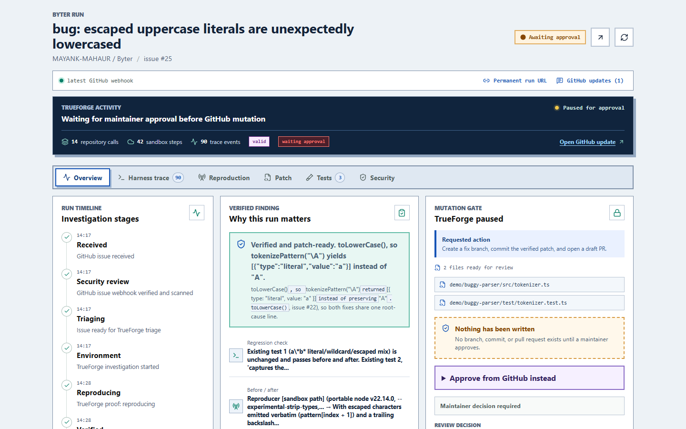
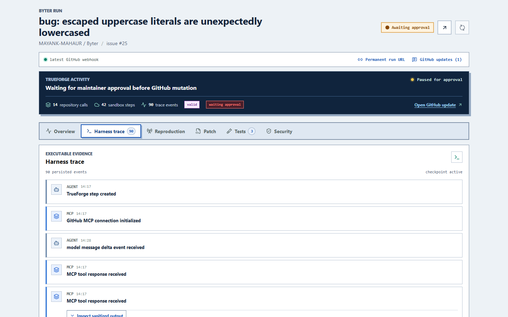
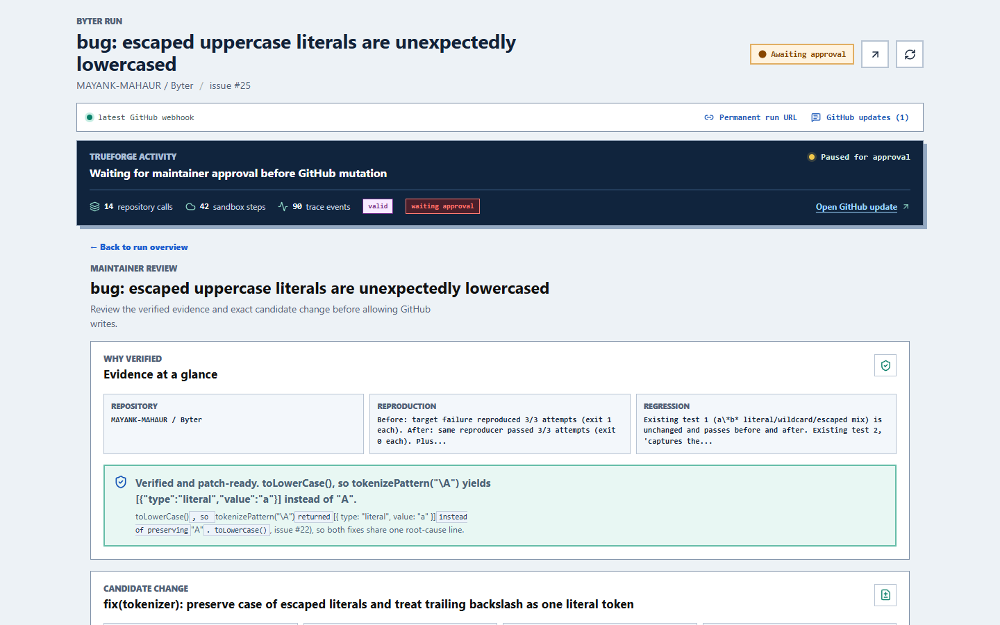

# Byter

**CI for bug reports.** Byter turns a GitHub issue into executable evidence, a tested candidate patch, and a human-controlled draft pull request.

[Open the live app](https://byter-production-1024.up.railway.app/) · [Inspect a verified run](https://byter-production-1024.up.railway.app/runs/github-MAYANK-MAHAUR-Byter-25-b03846ab693f) · [See the source issue](https://github.com/MAYANK-MAHAUR/Byter/issues/25)



## The Problem

Bug reports are descriptions, not proof. A maintainer still has to find the relevant code, reproduce the failure, rule out regressions, and decide whether an automated change is safe to write.

Byter makes that investigation repeatable:

1. A labeled GitHub issue starts a signed webhook run.
2. The issue is scanned as untrusted input.
3. TrueForge reads only the required repository context through GitHub MCP.
4. Code runs inside a disposable Daytona sandbox.
5. The same target failure must reproduce three times.
6. A candidate patch is checked against the reproducer and regression suite.
7. Byter pauses before any branch, commit, or pull request is created.
8. A maintainer reviews the exact change and replies `approve` on GitHub or approves in the dashboard.

The result is evidence before trust, and approval before mutation.

## See the Harness Work



The live trace shows repository calls, files inspected, bounded sandbox commands, and stdout or stderr. It presents agent findings and tool evidence without exposing private chain-of-thought or sensitive infrastructure details.



The review page keeps reproduction proof, the proposed diff, regression results, and the irreversible action in one place. Until approval, no branch or pull request exists.

## Why TrueForge

TrueForge is the durable agent harness at the center of Byter. It starts a model turn, exposes the narrow GitHub MCP toolset, provisions the Daytona execution environment, records every observable tool event, and returns a structured proof contract. Byter persists that contract so a maintainer can reconnect through a permanent run URL.

```text
GitHub issue
    |
    v
Byter intake ---- security scan ---- append-only progress comments
    |
    v
TrueForge ---- AgentRouter model
    |              |
    |              +---- GitHub MCP repository reads
    +---- Daytona sandbox commands
    |
    v
reproduction + patch + regression proof
    |
    v
maintainer approval ---- GitHub MCP write ---- draft pull request
```

This is a real integration, not a dashboard simulation. The public [verified run](https://byter-production-1024.up.railway.app/runs/github-MAYANK-MAHAUR-Byter-25-b03846ab693f) contains 90 persisted harness events, 14 repository calls, 43 sandbox steps, a three-run reproduction, a passing patched reproduction, and a regression check. It is deliberately paused at the approval boundary.

## Safety And Control

- Issue text is untrusted and scanned for prompt injection, credential requests, and destructive commands.
- The model receives scoped repository tools instead of unrestricted GitHub credentials.
- Sandbox output, paths, secrets, provider identifiers, and internal session details are redacted before public display.
- Reproduction and command output are bounded by time and size limits.
- Protected reproducer files and symlink escapes are rejected during patch validation.
- A verified label requires complete executable proof.
- Repository writes require explicit maintainer approval and produce a draft pull request.
- Progress is append-only on the issue, so each stage remains visible rather than rewriting history.

## Qodo Code Review Evidence

Qodo was part of the engineering loop, not a final badge. We opened focused pull requests, let Qodo review them, fixed valid findings, and requested follow-up reviews. Its feedback helped us improve correctness, reliability, performance, and security across the webhook, persistence, public API, and approval paths.

Representative evidence:

- [PR #14: start TrueForge sessions from webhooks](https://github.com/MAYANK-MAHAUR/Byter/pull/14) is a merged, substantive integration change reviewed by Qodo.
- [PR #23: live TrueForge harness visibility](https://github.com/MAYANK-MAHAUR/Byter/pull/23) is the merged product surface and final hardening pass.
- [Qodo's detailed review on PR #23](https://github.com/MAYANK-MAHAUR/Byter/pull/23#issuecomment-5462238474) records the concrete findings and follow-up discussion.

On PR #23, we addressed or made obsolete the reported issues around repeat-trigger labels, secret and filesystem-path leakage, non-unique run URLs and event IDs, unsafe host-derived links, missed label events, duplicate persistence, and oversized polling records. The resulting changes added stricter public-data normalization, credential and path redaction, trusted base URLs, stable identifiers, correct label handling, deduplicated writes, and targeted regression tests. Most actionable Qodo findings were fixed in code; findings that no longer applied were verified against the updated implementation rather than silently ignored.

<details>
<summary>Complete pull request and Qodo trail</summary>

| PR | Change | Result | Qodo trail |
| --- | --- | --- | --- |
| [#1](https://github.com/MAYANK-MAHAUR/Byter/pull/1) | Foundation | Merged | Before Qodo |
| [#2](https://github.com/MAYANK-MAHAUR/Byter/pull/2) | GitHub integration | Merged | Reviewed |
| [#3](https://github.com/MAYANK-MAHAUR/Byter/pull/3) | TrueForge adapter | Merged | Reviewed |
| [#4](https://github.com/MAYANK-MAHAUR/Byter/pull/4) | Reproduction engine | Merged | Reviewed |
| [#5](https://github.com/MAYANK-MAHAUR/Byter/pull/5) | Patch validation | Merged | Reviewed |
| [#6](https://github.com/MAYANK-MAHAUR/Byter/pull/6) | Dashboard console | Merged | Reviewed |
| [#7](https://github.com/MAYANK-MAHAUR/Byter/pull/7) | Documentation iteration | Closed | Reviewed |
| [#8](https://github.com/MAYANK-MAHAUR/Byter/pull/8) | End-to-end demo runner | Merged | Reviewed |
| [#9](https://github.com/MAYANK-MAHAUR/Byter/pull/9) | Workspace verification CI | Merged | Reviewed |
| [#10](https://github.com/MAYANK-MAHAUR/Byter/pull/10) | Reference-aware demo checks | Closed | Reviewed |
| [#11](https://github.com/MAYANK-MAHAUR/Byter/pull/11) | README polish | Merged | Reviewed |
| [#12](https://github.com/MAYANK-MAHAUR/Byter/pull/12) | Dashboard API integration | Merged | Reviewed |
| [#13](https://github.com/MAYANK-MAHAUR/Byter/pull/13) | Release readiness audit | Merged | Reviewed |
| [#14](https://github.com/MAYANK-MAHAUR/Byter/pull/14) | Webhook-to-TrueForge handoff | Merged | Reviewed and revised |
| [#15](https://github.com/MAYANK-MAHAUR/Byter/pull/15) | Webhook hardening | Closed | Reviewed |
| [#16](https://github.com/MAYANK-MAHAUR/Byter/pull/16) | Persisted dashboard runs | Merged | Qodo trial paused |
| [#17](https://github.com/MAYANK-MAHAUR/Byter/pull/17) | Persist TrueForge events | Merged | Qodo trial paused |
| [#18](https://github.com/MAYANK-MAHAUR/Byter/pull/18) | Live dashboard refresh | Merged | Qodo trial paused |
| [#19](https://github.com/MAYANK-MAHAUR/Byter/pull/19) | Remote GitHub MCP | Merged | Qodo trial paused |
| [#20](https://github.com/MAYANK-MAHAUR/Byter/pull/20) | Live API connection | Merged | Qodo trial paused |
| [#21](https://github.com/MAYANK-MAHAUR/Byter/pull/21) | Generated parser fix | Closed | Qodo trial paused |
| [#23](https://github.com/MAYANK-MAHAUR/Byter/pull/23) | Harness visibility and release hardening | Merged | Deep review, findings fixed |
| [#26](https://github.com/MAYANK-MAHAUR/Byter/pull/26) | Approval-generated parser fix | Closed draft | Proof output, not a product change |

</details>

## Run It Locally

Prerequisites: Node.js 22+ and pnpm 10+.

```bash
pnpm install
pnpm verify
```

`pnpm verify` builds, lints, type-checks, tests, and runs the deterministic end-to-end proof fixture. To open the dashboard locally:

```bash
pnpm build
pnpm --filter @byter/server start
pnpm dev
```

Copy `.env.example` to `.env.local` when configuring external services. Never commit local credentials. The main production integrations are TrueForge, AgentRouter, Daytona, GitHub webhooks, GitHub MCP, PostgreSQL, and Redis. AgentRouter requests require `User-Agent: Cline`.

## Repository Map

```text
apps/demo-runner       deterministic end-to-end proof fixture
apps/github-mcp        scoped GitHub read and approved-write tools
apps/server            webhooks, run persistence, API, and approvals
apps/web               live harness, evidence, patch, and security UI
demo/buggy-parser      intentionally seeded test repository
packages/agent         TrueForge adapter and structured proof contract
packages/core          state machine, shared types, and security scanner
packages/github        webhook verification and GitHub client
packages/repro-engine  reproduction, minimization, and patch validation
```

## Submission Links

- [Live application](https://byter-production-1024.up.railway.app/)
- [Reconnectable verified run](https://byter-production-1024.up.railway.app/runs/github-MAYANK-MAHAUR-Byter-25-b03846ab693f)
- [Current public repository](https://github.com/MAYANK-MAHAUR/Byter)
- [TrueForge Agent Harness Hackathon](https://www.wemakedevs.org/hackathons/trueforge)

Built for the TrueForge Agent Harness Hackathon.
